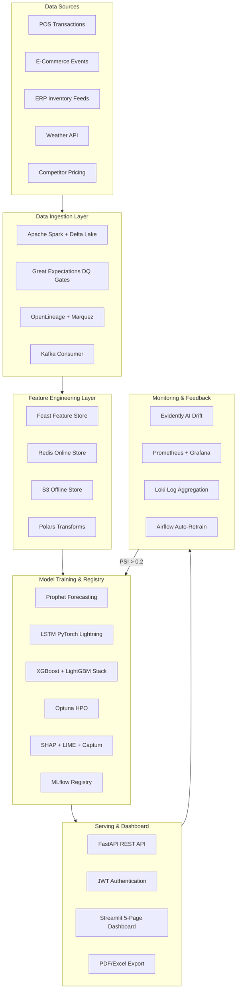
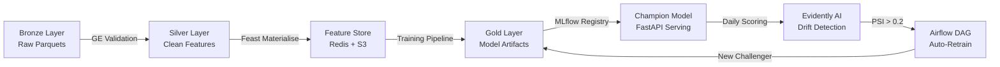
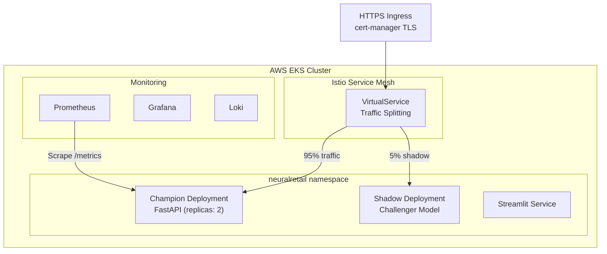

# NeuralRetail Architecture

## Overview

NeuralRetail employs a **Lakehouse + Feature Store + MLOps** architecture with five distinct layers.
The platform is designed for horizontal scalability, full observability, and automated model lifecycle management.

## MLOps Pipeline Architecture

## Data Flow Patterns

## Kubernetes Deployment Architecture

## Component Responsibilities

| Component | Technology | Responsibility |
|-----------|-----------|----------------|
| Data Ingestion | Spark + Delta Lake | Multi-source ETL with schema enforcement |
| Data Quality | Great Expectations + Soda | Automated DQ gates on every pipeline run |
| Data Lineage | OpenLineage + Marquez | End-to-end dataset provenance tracking |
| Feature Store | Feast (Redis + S3) | Consistent train/serve feature management |
| ML Training | XGBoost + LightGBM + Prophet + LSTM | Ensemble models with Optuna HPO |
| Experiment Tracking | MLflow 2.13 | Versioned experiments, model registry |
| Explainability | SHAP + LIME + Captum | Feature attribution for all model types |
| Causal Inference | DoWhy + EconML | Price elasticity and promotion attribution |
| Drift Detection | Evidently AI | PSI-based drift with auto-retrain trigger |
| API Serving | FastAPI + Uvicorn | REST endpoints with Pydantic validation |
| Dashboard | Streamlit + Plotly | 5-page interactive analytics UI |
| Orchestration | Apache Airflow | DAG scheduling with retry and alerting |
| Containerization | Docker (multi-stage) | Non-root, slim base, HEALTHCHECK |
| Infrastructure | Kubernetes + Helm 3 | EKS deployment with HPA autoscaling |
| CI/CD | GitHub Actions + ArgoCD | Lint → test → build → deploy → SLO gate |
| Monitoring | Prometheus + Grafana + Loki | Metrics, dashboards, log aggregation |
| IaC | Terraform + Terragrunt | AWS multi-resource provisioning |

## Environment Variables

| Variable | Description | Default |
|----------|-------------|---------|
| `DATABASE_URL` | PostgreSQL connection string | `sqlite:///data/neuralretail.db` |
| `REDIS_URL` | Redis connection for feature cache | `redis://localhost:6379/0` |
| `MLFLOW_TRACKING_URI` | MLflow server URI | `file:./mlruns` |
| `DRIFT_THRESHOLD` | PSI threshold for retraining trigger | `0.20` |
| `AIRFLOW_BASE_URL` | Airflow REST API base URL | `http://localhost:8080` |
| `PROMETHEUS_PUSHGATEWAY` | Pushgateway URL for metrics | _(empty)_ |
| `SECRET_KEY` | JWT signing secret | `neuralretail-secret-key` |
| `API_KEY` | API key for key-based auth | `neural_secret_key_prod_123!` |

## MLOps Lifecycle

- **Continuous Integration**: GitHub Actions for linting (Ruff + Black), testing (pytest), and security scanning (Bandit).
- **Continuous Deployment**: ArgoCD syncing Kubernetes manifests from Git. Staging auto-deploy on merge; production requires manual approval.
- **Model Monitoring**: Automated retraining triggered on high PSI (>0.2) or MAPE degradation (>15%).
- **Champion/Challenger**: Shadow deployment pattern via Istio VirtualService. Promote only if challenger improves AUC by ≥5%.
